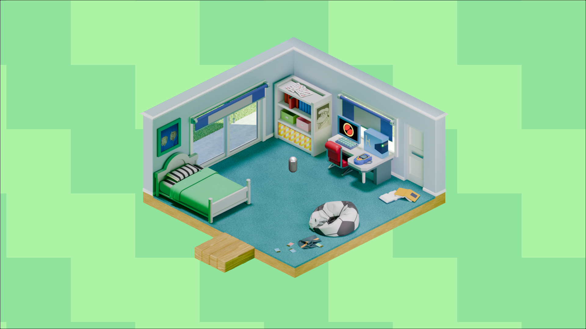

# Prebut

***Pre***-rendered ***B***ackground ***Ut***ilities

A suite of tools for making pre-rendered backgrounds in blender for
use in unity.

This project demonstrates a workflow for generating and usage of
pre-rendered backgrounds in unity, with most of the kinks worked
out. I'm making this project because I want to explore the artistic
avenues and technical considerations of pre-rendered backgrounds. I
admire the stylistic refinement, compositional intentionality, and
fullness of detail of PS1 era pre-rendered backgrounds. These seem to
be considerations which have lost emphasis in games since the hardware
limitation based motivation for the usage of pre-rendered backgrounds
was alleviated, so I decided to explore the potential of this approach,
while evoking a similar style, using modern tooling, through this
project.

This project works by exporting depth information from your scene in
blender and using that to specify the depth value in unity, which
allows objects in unity to move around pre-rendered objects. You can
then export simplified colliders from blender to allow accurate
collisions with pre-rendered objects.

This project supports both perspective and orthographic perspective,
including the ability to effectively pan around orthographic scenes. My
goal with this project was to make it quite flexible and minimally
interfere with your workflow.

## What's inside?

This project is composed of three parts; a blender add-on, and a unity
package, and an explanation of how to use them together.

The blender add-on provides a panel for exporting data about the
current scene and for generating a compositor node for feeding
rendered images into.

The Unity package provides a component which takes in the data and
textures generated by blender and constructs a pre-rendered background
setup in the scene.

## Installation

### Blender Add-on

1. Open Blender Preferences
2. Click "Install"
3. Navigate to `./BlenderAddon/prebut.py` and click "Install Add-On"
4. Click the checkbox next to "Render: Prebut"

### Unity

1. Open Unity "Package Manager" window
2. Click the plus in the top right
3. Click "Add package from disk"
4. Navigate to the Prebut root directory, and select the "package.json" file

## Usage

Note that this workflow is quite explicit to make sure it works the
first time, feel free to vary it up once you understand what is going
on.

1. Make the blender assets
    1. Build a scene in blender. 
    2. Open the Prebut panel in the 3D viewport or the node editor
    3. Click "Enable Depth Layer" to enable rendering the depth pass (this
       is not needed if this pass is already enabled)
    4. Configure a directory to save the generated assets to in "Export Directory"
    5. Click "Export Data" (This saves relevant data about your scene to
       your export directory. Click this again if you change camera
       settings)
    6. Click "Configure Export Node" (The add-on should henceforth send
       all relevant configurations to this node on render, but you can
       always click it manually to update the node)
    7. In the compositing node editor, connect `Render Layers/Image` to
       `Prebut Texture Export/Image` and `Render Layers/Depth` to `Prebut
       Texture Export/Depth`. You can add any compositing nodes you want
       between `Render Layers/Image` and `Prebut Texture Export/Image` to
       change the look.
    8. (Optional) Toggle `Properties > Render > Film > Transparent` on
       to have color texture terminate at edge of visible content for
       specifying a clear color in Unity.
    8. Render image. (Make sure you are on a consistent frame,
       otherwise it will change the outputted files name.)
    9. Export simplified version of the scene for use in unity. 
       1. Move camera and main lights to a separate collection if they
          aren't already, henceforth called "Shared"
       2. Make a collection with simplified meshes which will act as the
          colliders for the detailed objects you have in your scene,
          henceforth called "Colliders"
       3. Make it so only Shared and Colliders are Visible
       4. Click `File > Export > FBX`
       5. Toggle on `Include > Limit to > Visible Objects`
       6. Navigate to Export Directory
       7. Click "Export FBX"
2. Make the Unity scene
   1. Move the generated files into Unity
   2. Apply presets to pre-rendered color and depth textures
       1. Select pre-rendered color texture
       2. Click the preset button in the top right of the inspector
          - If your color texture has alpha set "Alpha Source" to
            "Input Texture Alpha" and "Alpha is Transparency" to True
       3. Click "PreRenderedColorTexture"
       4. Do the same with the pre-rendered depth texture and "PreRenderedDepthTexture"
   3. Add the setup component to the scene
      1. Make a root game object named "Setup"
      2. Add the component `Prebut/Setup Pre-Rendered Background`
      3. Set the scene field to the prefab for the exported FBX file to "Scene"
      4. Set the exported color texture, depth texture, and extra data to the corresponding fields
      5. Set a background layer (This should be a layer which is not seen by any other cameras)
      6. If your scene is orthographic you can check "Add Orthographic
         Camera Center Controller" to allow panning around your scene.
      7. Set a background color, which is what content outside the
         visible part of the color texture gets cleared to.
      8. Click "Setup"
          - The other setting can be left default for now
          - When you make a change to any of the referenced data,
            click "Setup" again to update the configuration
            
That should be all you need to do. Hit play then you can move a 3D
object around the scene to see it interact with the pre-rendered
parts. Select "Setup" to see colliders to get an idea of where
everything is.

## Custom Clear

This library has another piece of functionality. The ability to clear
the background with a scrolling repeating pattern. This is a common
stylistic tool used for this approach, so I decided to give it official
support.

### Usage

Once you have a scene with `Prebut/Setup Pre-Rendered Background` component
in it, follow these steps to add custom clearing.

1. Add a game object called "BackgroundClear"
2. Add the component `Prebut/Background Clear`. All settings are
   optional.
3. Add the game object to a layer which only contains this object and
   is not seen by any cameras. Henceforth, called the "Clear Layer"
4. In the `Prebut/Setup Pre-Rendered Background` component toggle
   "Should Clear Colors" to False and add the clear layer to hidden
   layers, then click "Setup"

This component should print warnings on play if there are settings in
the current scene which interfere with it, but that should be enough
to work.

## Orthographic Camera Center Controller

A common approach with this technique is zooming in on and panning
around a large pre-rendered scene. It is not trivial to keep the depth
and color camera and 3D scene camera in sync so to facilitate this
project has the "Orthographic Camera Center Controller"
component. This is generated automatically by the `Prebut/Setup
Pre-Rendered Background` component if the pre-rendered scene was
generated with an orthographic camera and "Add Orthographic Camera
Center Controller" is checked.

The usage is simple. Set Center to the position in world space which
you want the view to center on. Set Zoom to the zoom level you want.

## Acknowledgments

- [Pre-Rendered Backgrounds
  Aesthetics](https://twitter.com/prbg_aesthetics) for aggregating so
  many examples of this medium, and inspiring me to understand it.
- [SpookyFM/DepthCompositing: Depth Compositing Demo in Unity and
  Blender](https://github.com/SpookyFM/DepthCompositing/) for giving
  me some starting intuitions for understanding this approach.
